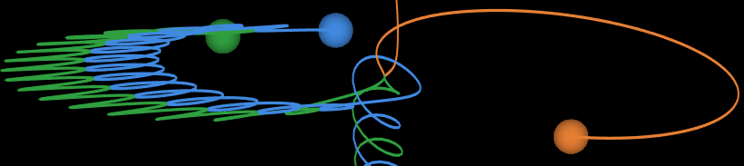

# Scatter

A WebGL tool to display output from scattering simulations

A live version is available [here](https://ageller.github.io/Scatter_WebGL/).

## Keyboard Shortcuts

- SPACE: play/pause
- hold "T" + left/right arrow keys: moves time forward/backwards by one itme step
- hold "T" + up/down : change the time step factor to accelerate/decelerate the time evolution
- hold "A" + up/down/left/right : rotate the camera
- hold "S" + up/down : zoom the camera
- hold "D" + up/down/left/right : pan the camera

